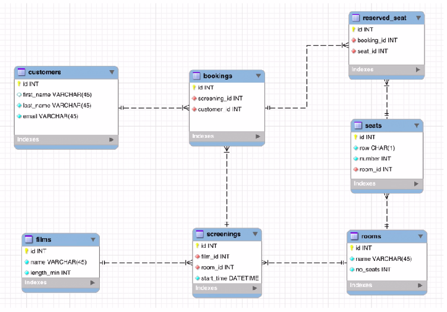

# Cinema Booking System
creating a Cinema Booking System

## Requirements
- create a database for a Cinema Online Booking System
- consisting of 7 tables
  - Films
  - Customers
  - Rooms
  - Screenings
  - Seats
  - Bookings
  - Reserved Seats
- inserting sample data into tables

## Creating Database and all table schemas
[Table Schema](./schema.sql)
